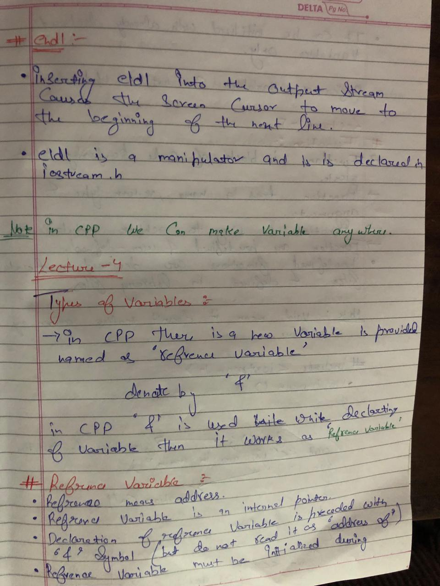
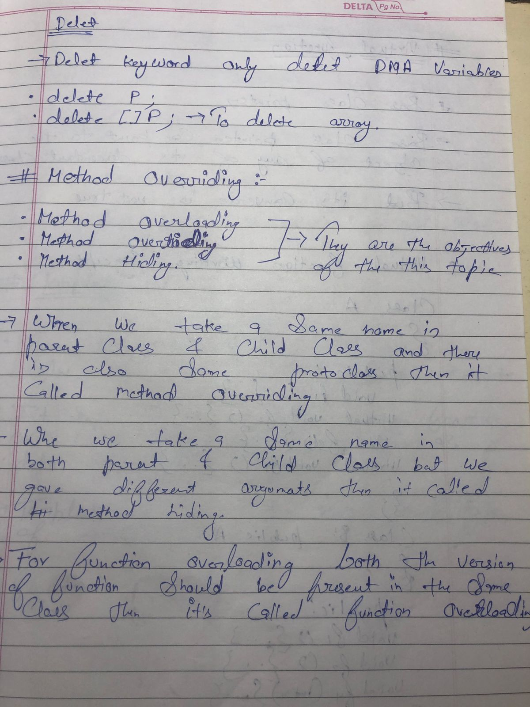
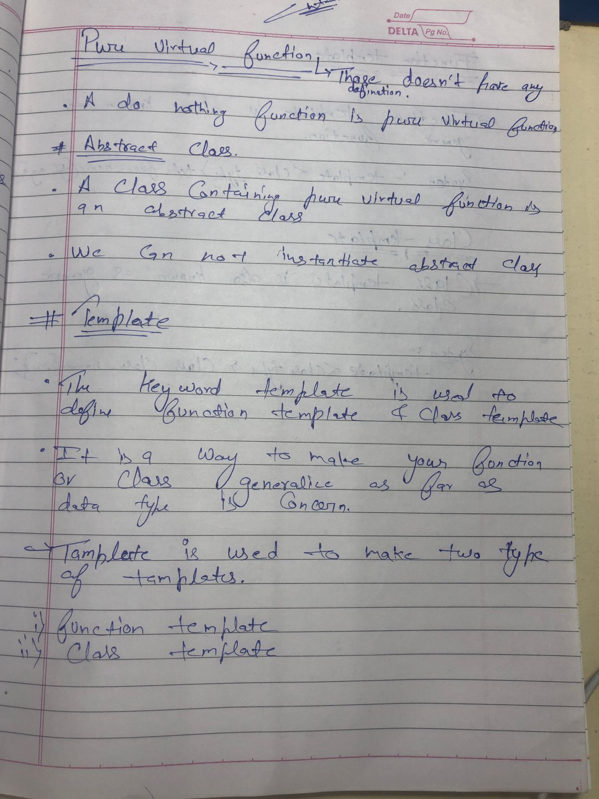
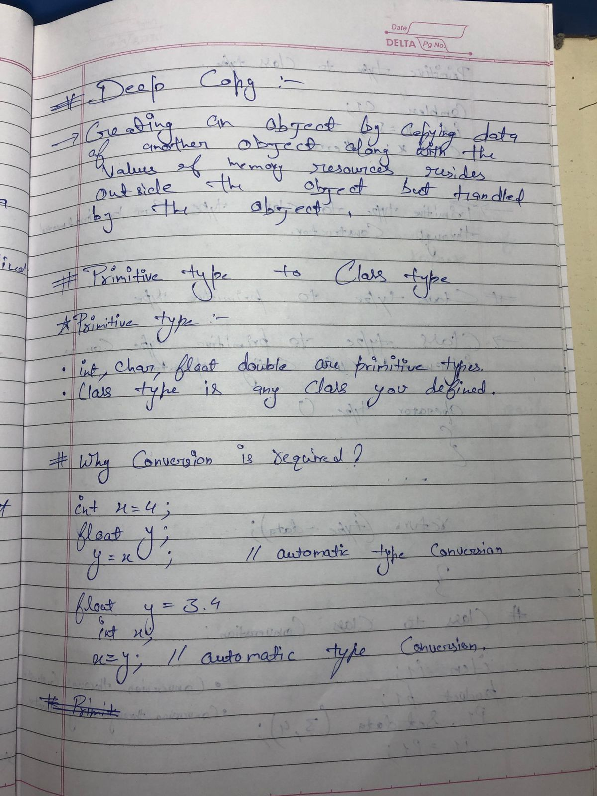
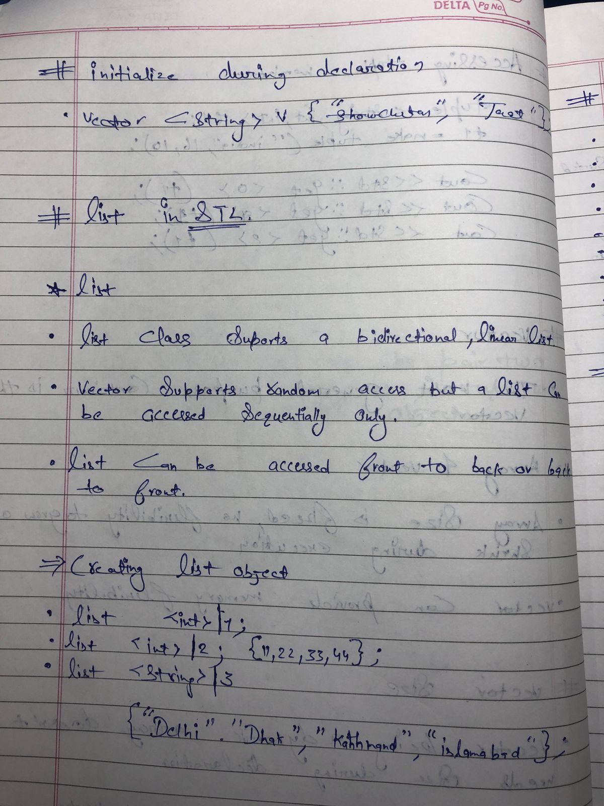

CPP--Notes by sourabh sukla's youtube tutorial

Some notes regarding the cpp 
This cpp tutorial provided by the sourabh shukla on hi syoutube channel

# PAGE=1

# PAGE=2

# PAGE=3

# PAGE=4

# PAGE=5

# PAGE=6

# PAGE=7

# PAGE=8

# PAGE=9

# PAGE=10
![cpp notes10]../cppimages/cpp010.jpeg)
# PAGE=11

# PAGE=12

# PAGE=13

# PAGE=14

# PAGE=15

# PAGE=16

# PAGE=17

# PAGE=18

# PAGE=19

# PAGE=20

# PAGE=21

# PAGE=22

# PAGE=23

# PAGE=24

# PAGE=25

# PAGE=26

# PAGE=27

# PAGE=28

# PAGE=29

# PAGE=30

# PAGE=31

# PAGE=32

# PAGE=33

# PAGE=34

# PAGE=35

# PAGE=36

# PAGE=37

# PAGE=38

# PAGE=39

# PAGE=40

# PAGE=41

# PAGE=42

# PAGE=43

# PAGE=44

# PAGE=45

# PAGE=46

# PAGE=47

# PAGE=48

# PAGE=49

# PAGE=50

# PAGE=51

# PAGE=50

# PAGE=52

# PAGE=53

# PAGE=54

# PAGE=55

# PAGE=56

# PAGE=57

# PAGE=58

# PAGE=59

# PAGE=60

# PAGE=61

# PAGE=62

# PAGE=63

# PAGE=64

